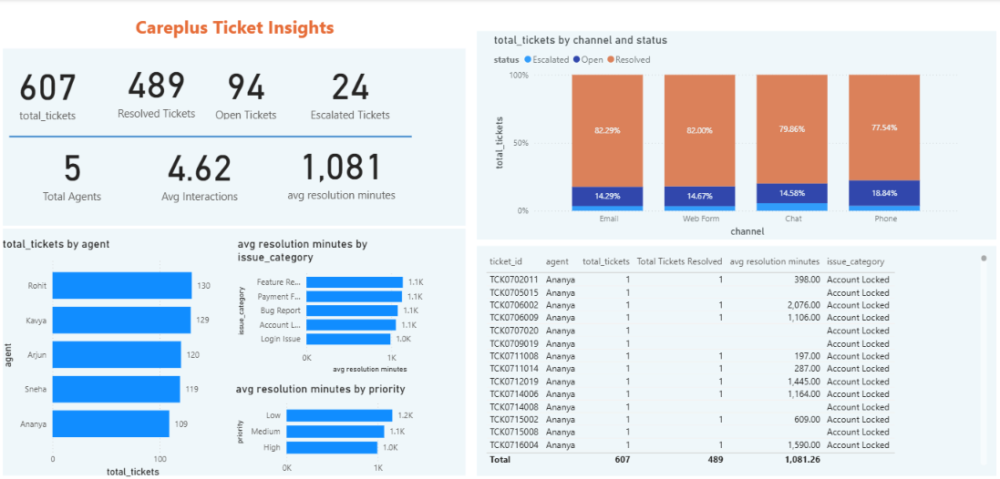
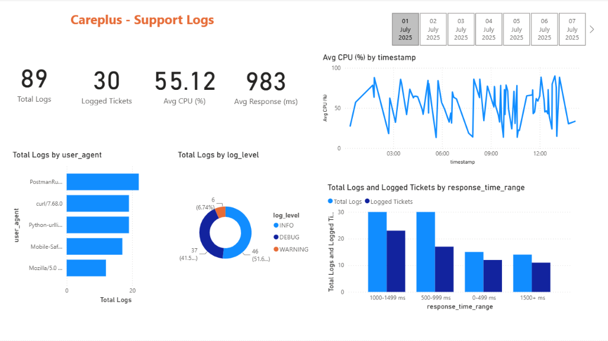

# CarePlus Support Analytics

An end-to-end cloud data pipeline and analytics platform for analyzing customer support tickets and system logs using AWS, Python, SQL, Amazon Redshift, and Power BI.

## 📌 Project Overview

CarePlus Support Analytics is a cloud-based data engineering and business intelligence project designed to transform raw customer support data into meaningful business insights.

The project processes support ticket records and system logs through an automated ETL pipeline. The cleaned data is stored in cloud storage, queried using SQL, loaded into a cloud data warehouse, and visualized through interactive Power BI dashboards.

The project demonstrates practical applications of:

- Data ingestion and ETL
- Cloud data storage
- Data cleaning and transformation
- SQL analytics
- Data warehousing
- Business intelligence and dashboard development

## 🏗️ Architecture

```text
MySQL Database
      │
      ▼
Python + Jupyter Notebook
      │
      ▼
Amazon S3 (Raw Data)
      │
      ▼
AWS Lambda
(ETL and Data Cleaning)
      │
      ▼
Amazon S3 (Processed Parquet)
      │
      ├──────────────► Amazon Athena
      │                    │
      │                    ▼
      │                SQL Analytics
      │
      ▼
Amazon Redshift Serverless
      │
      ▼
Power BI
      │
      ▼
Interactive Analytics Dashboards
```

## 🛠️ Technology Stack

| Category | Technologies |
|---|---|
| Programming | Python |
| Data Processing | Pandas, PyArrow |
| Database | MySQL |
| Cloud Storage | Amazon S3 |
| Cloud Computing | AWS Lambda |
| Data Querying | Amazon Athena, SQL |
| Data Warehouse | Amazon Redshift Serverless |
| File Format | Apache Parquet |
| Visualization | Microsoft Power BI |
| Development | Jupyter Notebook |
| Cloud Platform | Amazon Web Services (AWS) |

## 🔄 Data Pipeline

### 1. Data Ingestion

Support ticket data is extracted from a MySQL database using Python and Jupyter Notebook.

The data is uploaded to Amazon S3 in CSV format under the raw data directory.

### 2. Data Storage

Amazon S3 is used as the cloud storage layer for raw and processed data.

- Raw data: CSV files
- Processed data: Parquet files
- Separate raw and processed folders for organized data management

### 3. ETL Using AWS Lambda

AWS Lambda processes newly uploaded support ticket files.

The transformation process includes:

- Renaming inconsistent column names
- Standardizing priority values
- Removing invalid interaction records
- Removing duplicate records
- Converting date columns into appropriate datetime formats
- Handling missing agent feedback values
- Converting processed data into Parquet format

### 4. Data Querying Using Amazon Athena

Amazon Athena is used to query processed Parquet files stored in Amazon S3.

Example analysis includes:

- Ticket count by channel
- Ticket status distribution
- Tickets created by date
- Average CPU usage by user agent
- System logs grouped by user agent

### 5. Data Warehousing Using Amazon Redshift

Amazon Redshift Serverless is used as the cloud data warehouse for analytical queries.

The project uses a PostgreSQL-compatible SQL interface to load and analyze processed support ticket data.

### 6. Power BI Dashboards

Power BI is connected to Amazon Redshift to create interactive dashboards for support operations and system log analysis.


## 📊 Dashboards

### CarePlus Ticket Insights

The dashboard provides insights into customer support ticket performance, including ticket status, resolution metrics, agents, channels, and issue categories.



### CarePlus Support Logs

The dashboard analyzes system logs, CPU usage, response time, log levels, and user-agent activity.



## 🧹 Data Quality and Transformation

The pipeline handles common data quality problems, including:

- Inconsistent priority labels
- Invalid interaction values
- Duplicate records
- Missing feedback values
- Date and timestamp conversion
- Consistent column naming

## ☁️ AWS Services Used

- **Amazon S3:** Cloud-based raw and processed data storage
- **AWS Lambda:** Serverless ETL processing
- **Amazon Athena:** SQL querying over S3 data
- **Amazon Redshift Serverless:** Cloud data warehousing and analytical queries

## 📚 Key Learning Outcomes

- Designing an end-to-end data pipeline
- Working with AWS S3 and Lambda
- Processing CSV and Parquet files
- Performing data cleaning using Python
- Querying data using Athena SQL
- Loading data into Amazon Redshift
- Connecting Power BI to a cloud data warehouse
- Understanding the relationship between data engineering and business intelligence

## 👤 Author

**Name:** Sagar Jagdale  
**LinkedIn:** [LinkedIn Profile](https://www.linkedin.com/in/sagar-jagdale-922a81290/)  
**Email:** [jagdalesagar040@gmail.com](mailto:jagdalesagar040@gmail.com)
