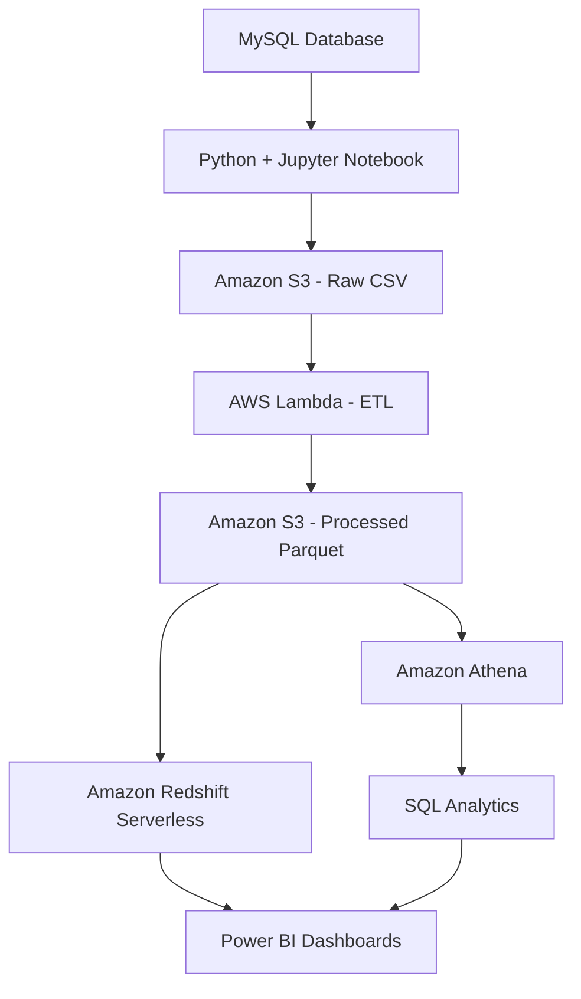

# CarePlus Support Analytics Architecture

## End-to-End Data Pipeline

## Pipeline Description

1. **MySQL:** Stores the original support ticket records.
2. **Python and Jupyter Notebook:** Extracts data from MySQL and uploads it to Amazon S3.
3. **Amazon S3:** Stores raw CSV files and processed Parquet files.
4. **AWS Lambda:** Cleans and transforms incoming ticket and log data.
5. **Amazon Athena:** Queries processed Parquet files using SQL.
6. **Amazon Redshift Serverless:** Stores data for analytical querying.
7. **Power BI:** Connects to the analytical data and presents interactive dashboards.
